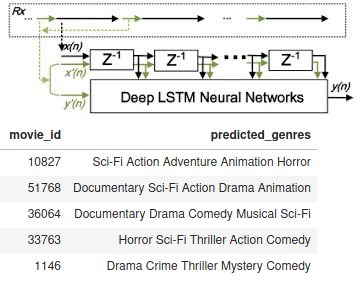

# NLP--film-genres-from-synopsis

## 1. Background
Public movies’databases such as IMDB provide genre information to assist searching. The tagging of movies’genres is still a manual process which involves the collection of users'suggestions sent to known email addresses provided by the database. Movies are often registered with inaccurate genres. Automatic  genres  classification of a movie based on its synopsis not only speeds up the classification process by providing a list of suggestion but the result may potentially be more accurate than that of an un-trained human.

## 2. The data
Data have been downloaded from Radix challenge Kaggle dataset

https://gitlab.com/radix-ai/challenge

##  3. The model
This Python [notebook]() contains the code to obtain automatically the film genres from the synopsis.

Best results have been obtained with deep learning, coding a very simple Keras LSTM.
Higher accuracy than classical ML models such as Logistic Regression (50% vs. 10%)

